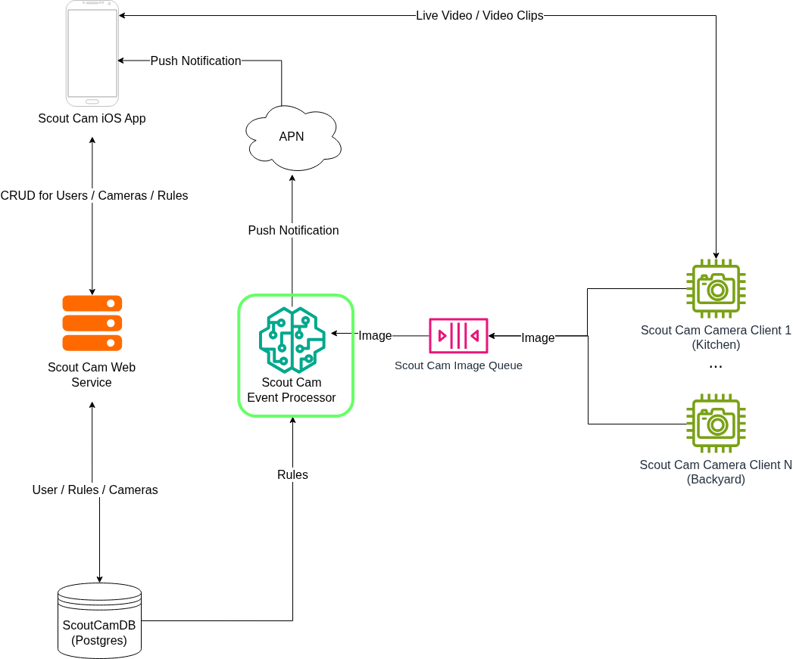

# ScoutCamEventProcessor
A scalable microservice for processing images from the Scout Camera Client. The event processor
compares images against rules using a vision language model and sends a push notification
to users if the image matches the users specified rule.

### System Diagram

### Brief Overview
[Scout Cam Web Service](https://github.com/ataffe/ScoutCamEventProcessor) - Handles CRUD operations for Users, Cameras, and Rules.

[Scout Cam Event Processor](https://github.com/ataffe/GuardianCamCameraClient) - Processes images received from cameras and send users a push notification if the 
image matches one or more of the users rules.

[Scout Cam Camera Client](https://github.com/ataffe/GuardianCamCameraClient) - Detects Motion and filters images using object detection and then sends the image to the 
event processor if an object is detected.

Scout Cam iOS App - User app for managing cameras and notifing the user of events.

---